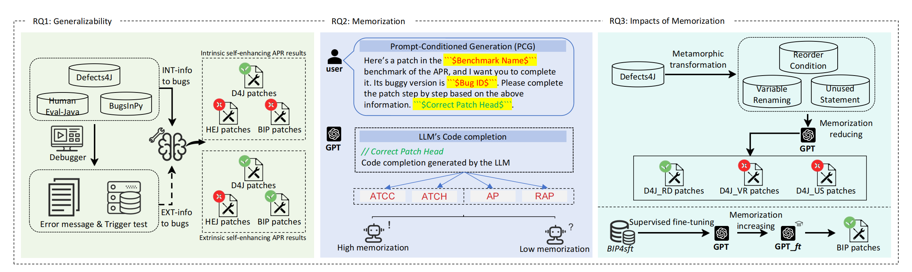
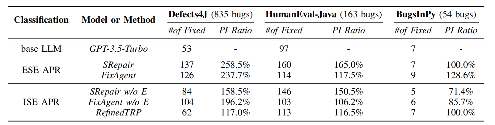

# Empirical-study-of-LLM-based-self-enhancing-APRs

## Table of Contents
- [Introduction](#introduction)
- [Installation](#installation)
- [Usage](#usage)
- [Contributing](#contributing)
- [License](#license)

## Introduction

*Figure 1: The overview of our empirical study.*
### RQ1: Generalizability
In this section, we focus on the performance of self-enhanced APR tools under three benchmarks by using the debugger(static or dynamic), extracting error messages, and trigger tests. And gain patches in two settings: (1) with intrinsic information and (2) with extrinsic information. 
### RQ2: Memorization
In this section, we verified the memorization level of base LLM (gpt-3.5-turbo-0125) on three benchmarks (i.e., Defects4J, HumanEval-Java, and BugsInPy), and we used four metrics as ATCC, ATCH, AP, and RAP.
### RQ3: Impact of Memorization 
RQ3-1: To explore how APR tools can behave in transformed contexts(reduce memorization level), the repair process is replayed on the transformation of Defects4J code. 

RQ3-2: To Introduce the knowledge about BugsInPy to LLM, we finetune LLM with BugsInPy code and replay the repair process. The number of patches generated is expected to be related to the level of memorization.

## Installation
In the paper, we refer to the relevant work of an article from the APR journal. The content involved is extensive, and the related environmental configuration information can be found in the `/APRS` directory.

## Datasets
Defects4J: https://github.com/rjust/defects4j

HumanEval-Java: https://github.com/ASSERT-KTH/human-eval-java

BugsInPy: https://github.com/JohnnyPeng18/TypeFix


## Usage
### RQ1: Generalizability
#### 1. Refined Test Report Prompt
We have refined the TRP work, and the current workflow is as follows: Step 1, fix the code. Step 2, generate a test report based on the revised code. Step 3, revise the code again based on the generated test report. The relevant prompt information can be accessed in path `/APRs/TRP/trp_consists.py`. And relevant code script can be accessed in path `/APRs/TRP/RefinedTRP.py`.  
Example usage:
```bash
python /APRs/TRP/RefinedTRP.py -out fixed_code.json -code buggy_code.json -api YOUR_API_KEY -model gpt-3.5-turbo-0125 -lang Python
```

#### 2. FixAgent

We use the default settings for FixAgent. There are three agents used: fixer (fix the actual code), analyzer (reasoning the code), and localizer (localize the wrong code).

#### 3. SRepair

The same settings as SRepair, Comment/Buggy Code, Trigger Test, and Error message are extracted from datasets, which are leveraged from Repair Suggestions. In the last step, the Generation model is requested to fix the code.

### RQ2: Memorization
You can use the functions complete_function_and_perplexity and sliding_window_clone_detection to calculate ATCC, ATCH, AP, and RAP for any benchmarks, or you can just use the function calculate_bugsinpy(), calculate_d4j_all(), calculate_humanevaljava() to calculate ATCC, ATCH, AP, and RAP for the three benchmarks. All these functions are in the script RQ2/RQ2.py.

### RQ3: Impact of Memorization

#### RQ3-1: Reducing memorization
To use JavaTransformer, you need to change your data format to a Java file (you can use the function write_d4j1_2java in RQ31/RQ3_1.py to change the format or re-implementation this feature). After that, you can transform Defects4J with JavaTransformer (using mutation operators VR, RC, and US). Note that JavaTransformer can only receive function-level code snippets, so you need to extract the buggy function from Defects4J. When finishing the transformation, you can fix these bugs exactly the way you experimented with RQ1.  

#### RQ3-2: Increasing memorization
Use the model in RQ32/finetuned_model to re-fix the BugsInPy (54 bugs). In fact, you can also fine-tune gpt-3.5-turbo-0125 yourself using BIP4sft, and we will be releasing BIP4sft dataset soon. We do not provide a script for fine-tuning GPT because OpenAI provides a very convenient web-side fine-tuning method; see https://platform.openai.com/finetune for more details.

### Evaluate Datasets

#### (1) Evaluate Defects4J
```
python evaluate_d4j.py -loc {location of buggy function place} -out {eval result json} -pat {patches json file generated in former steps} -tmp {temp folder to hold env}
```
#### (2) Evaluate HumanEval
```
python evaluate_hej.py -pat {patches json file generated in former steps} -human_eval_dir {human eval datatset folder} -result {file to store eval result}
```

### (3) Evaluate BugsInPy
```
python evaluate_bip.py -pat {patches json file generated in former steps} -out {out file to store result} -bip_folder {folder to hold BugsInPy environment} -loc {location file that indicates fault location in code}
```

## Results

*Table 1: Number of fixed defects and enhancement rations of the base LLM and LLM-based self-enhancing APRs on three benchmarks.*

*Table 2: NFD and ERS of the base LLM and intrinsic LLM-based self-enhancing APRs on memorization-decayed Defects4J.*

## Contributing
If you would like to contribute to the project, please open an issue or submit a pull request.

## License
This project is licensed under the MIT License - see the [LICENSE](LICENSE) file for details.
